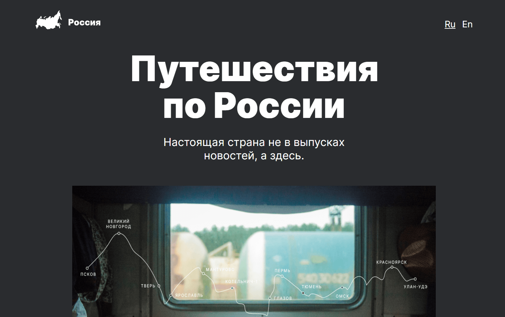

# Проект: Путешествие по России

Учебный проект выполненный в рамках курса "Веб-разработчик" от Яндекс Практикум. Проект представляет из себя лендинг рассказывающий о путешествиях по России, и интересных местах для отдыха.

## Оглавление

- [Обзор проекта](#обзор-проекта)
  - [Описание проекта](#описание-проекта)
  - [Задачи проекта](#задачи-проекта)
  - [Функциональность проекта](#функциональность-проекта)
  - [Screenshot](#screenshot)
  - [Ссылки](#ссылки)
- [Ход выполнения проекта](#ход-выполнения-проекта)
  - [Используемые технологии](#используемые-технологии)
  - [Чему я научился работая над проектом](#чему-я-научился-работая-над-проектом)
- [Автор](#автор)

## Обзор проекта

## Скриншот

## Описание проекта

Самая главная отличительная черта данной проектной работы от предыдущих заключается в том, что в ней была реализована адаптивная верстка под различные разрешения экранов, от мобильных до декстопных версий. Отзывчивый дизайн и резиновая верстка в симбиозе позволяют комфортно пользоваться сайтом на разных устройствах независимо от ширины экрана.

Проект написан в ходе образовательной работы на [Яндекс Практикуме](https://practicum.yandex.ru/).

### Задачи проекта

Проект был призван изучить основы HTML, CSS, семантической вёрстки, БЭМ, и адаптивной вёрстки.

### Функциональность проекта

Проект выполнен в виде лендинга состоящего из нескольких секций. В проекте реализованы различные подходы к позиционированию и выравниванию элементов, в том числе Flexbox и Grid Layout. Проект адаптирован для просмотра на мобильных устройствах.

### Директории проекта

------
- `/blocks` — директория с CSS файлами
- `/vendor/fonts` — директория со шрифтами
- `/images` — директория с файлами изображений
- `/pages` — директория с файлами страниц

### Ссылки

------
* [Ссылка проекта на GitHub Pages](https://spetrosyan94.github.io/russian-travel)

* [Ссылка на макет в Figma](https://www.figma.com/file/5S2WSbEFL6awjVWJ0NWL8Q/Sprint-3_-Russia-_-desktop-%2B-mobile?type=design&node-id=62863-634&mode=design&t=IcdpeStJP25rBsS5-0)

## Ход выполнения проекта

### Используемые технологии

- HTML
- CSS
- Семантическая вёрстка
- Адаптивная вёрстка
- БЭМ, включая использование схемы файловой структуры Nested

### Чему я научился работая над проектом

- Позиционированию и выравниванию элементов страницы при помощи различных подходов
- Семантической вёрстке
- Адаптивной вёрстке
- Методологии БЭМ

## Автор

**Петросян Сергей**

Сайт "Путешествия по России" разработан и поддерживается [Петросяном Сергеем](https://github.com/spetrosyan94) - https://github.com/spetrosyan94.

e-mail: [syspect@bk.ru](mailto:syspect@bk.ru)
